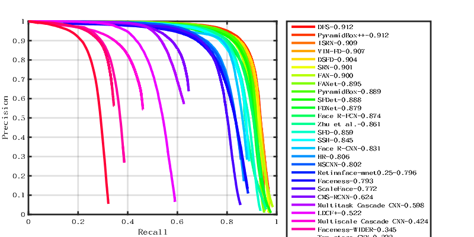
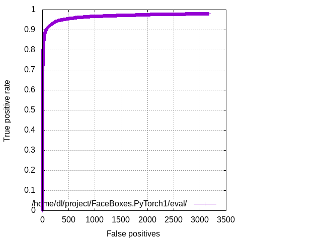
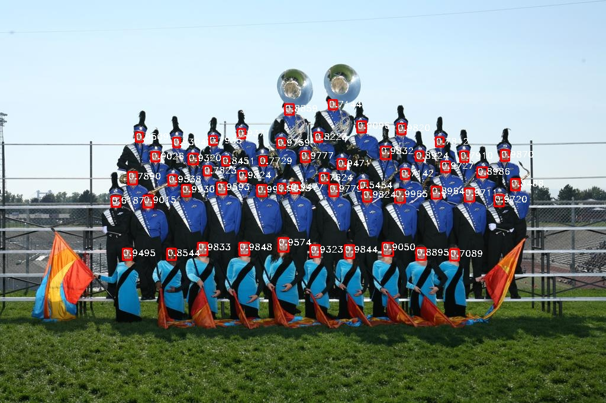
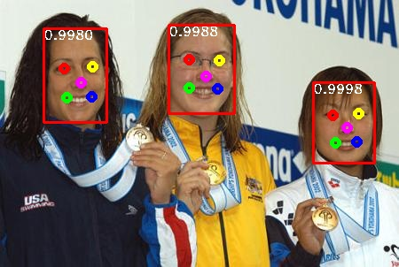

# RetinaFace in PyTorch

A [PyTorch](https://pytorch.org/) implementation of [RetinaFace: Single-stage Dense Face Localisation in the Wild](https://arxiv.org/abs/1905.00641). Model size only 1.7M, when Retinaface use mobilenet0.25 as backbone net. The official code in Mxnet can be found [here](https://github.com/deepinsight/insightface/tree/master/RetinaFace).

## WiderFace Val Performance in single scale When using Mobilenet0.25 as backbone net.
| Style | easy | medium | hard |
|:-|:-:|:-:|:-:|
| Pytorch (same parameter with Mxnet) | 86.85 % | 85.84% | 79.69% |
| Pytorch (original image scale) | 90.58 % | 87.94% | 73.96% |
| Mxnet | 88.72% | 86.97% | 79.19% |
| Mxnet(original image scale) | 89.58% | 87.11% | 69.12% |
<p align="center"></p>

## FDDB Performance When using Mobilenet0.25 as backbone net.
| Dataset | performance |
|:-|:-:|
| FDDB(pytorch) | 97.93% |
<p align="center"></p>

### Contents
- [Installation](#installation)
- [Training](#training)
- [Evaluation](#evaluation)
- [References](#references)

## Installation
##### Clone and install
1. git clone https://github.com/biubug6/Pytorch_Retinaface.git

2. Pytorch version 1.1.0+ and torchvision 0.3.0+ are needed.

3. Codes are based on Python 3

##### Data
1. Download the [WIDERFACE](http://shuoyang1213.me/WIDERFACE/WiderFace_Results.html) dataset.

2. Download annotations (face bounding boxes & five facial landmarks) from [baidu cloud](https://pan.baidu.com/s/1Laby0EctfuJGgGMgRRgykA) or [dropbox](https://www.dropbox.com/s/7j70r3eeepe4r2g/retinaface_gt_v1.1.zip?dl=0)

3. Organise the dataset directory as follows:

```Shell
  ./data/widerface/
    train/
      images/
      label.txt
    val/
      images/
      wider_val.txt
```
ps: wider_val.txt only include val file names but not label information.

##### Data1
We also provide the organized dataset we used as in the above directory structure.

Link: from [baidu cloud](https://pan.baidu.com/s/1jIp9t30oYivrAvrgUgIoLQ) Password: ruck

## Training
We trained Mobilenet0.25 on imagenet dataset and get 46.75%  in top 1. We use it as pretrain model  which has been put in repository named ``model_best.pth.tar``.
1. Before training, you can check the mobilenet*0.25 network configuration (e.g. batch_size, min_sizes and steps etc..) in ``data/config.py and train.py``.

2. Train the model using WIDER FACE:
  ```Shell
  python train.py
  ```

If you do not wish to train the model, we also provide trained model in `./weights/Final_Retinaface.pth`.

## Evaluation
### Evaluation widerface val
1. Generate txt file
```Shell
python test_widerface.py --trained_model weight_file
```
2. Evaluate txt results. Demo come from [Here](https://github.com/wondervictor/WiderFace-Evaluation)
```Shell
cd ./widerface_evaluate
python setup.py build_ext --inplace
python evaluation.py
```
3. You can also use widerface official Matlab evaluate demo in [Here](http://mmlab.ie.cuhk.edu.hk/projects/WIDERFace/WiderFace_Results.html)
### Evaluation FDDB

1. Download the images [FDDB](https://drive.google.com/open?id=17t4WULUDgZgiSy5kpCax4aooyPaz3GQH) to:
```Shell
./data/FDDB/images/
```

2. Evaluate the trained model using:
```Shell
python test.py --dataset FDDB
```

3. Download [eval_tool](https://bitbucket.org/marcopede/face-eval) to evaluate the performance.

## RetinaFace-MobileNet0.25
<p align="center"></p>
<p align="center"></p>

## References
- [FaceBoxes](https://github.com/zisianw/FaceBoxes.PyTorch)
- [Retinaface (mxnet)](https://github.com/deepinsight/insightface/tree/master/RetinaFace)
```
@inproceedings{deng2019retinaface,
title={RetinaFace: Single-stage Dense Face Localisation in the Wild},
author={Deng, Jiankang and Guo, Jia and Yuxiang, Zhou and Jinke Yu and Irene Kotsia and Zafeiriou, Stefanos},
booktitle={arxiv},
year={2019}
```
